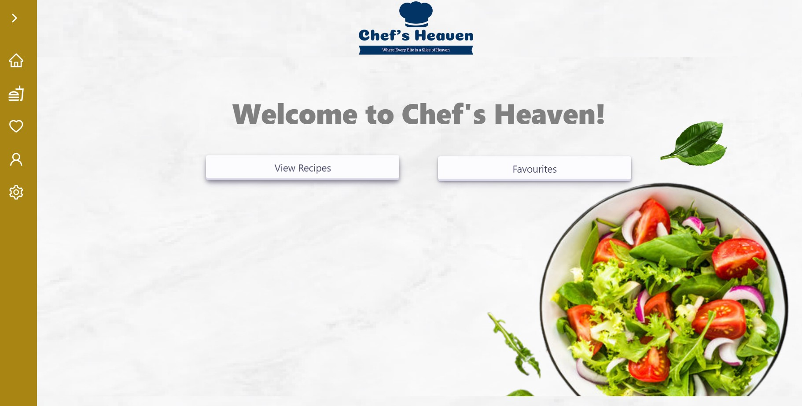
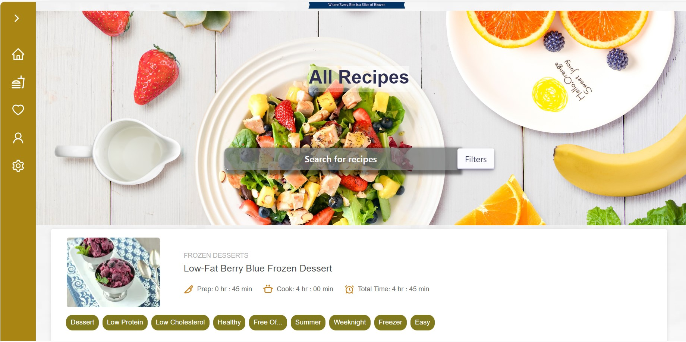
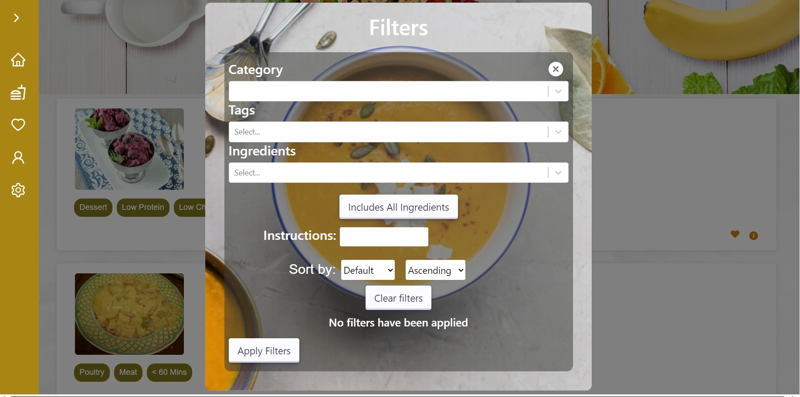
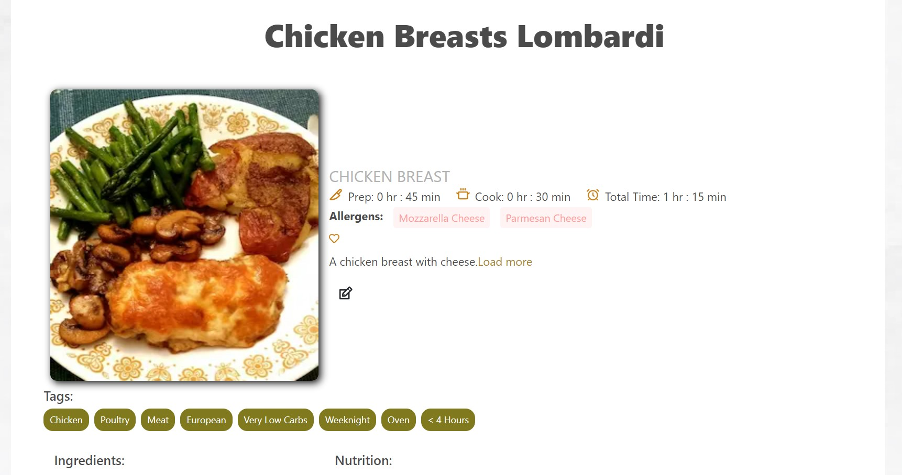
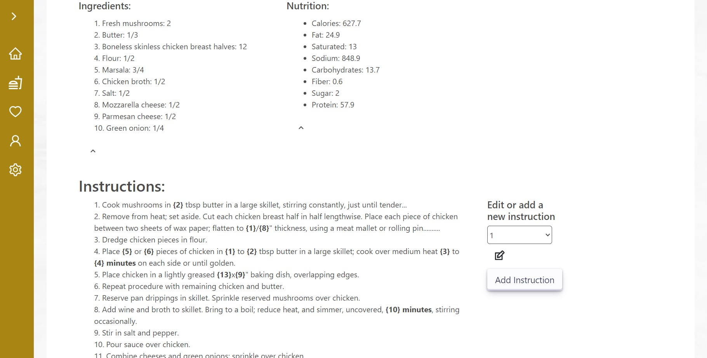

# ASE_2023_GROUP_E

Welcome to Group E!

We're a team of eight Junior Software Developers embarking on an exciting journey to craft a cutting-edge Recipe App. Our goal is to provide 
users with an intuitive and seamless interface, ensuring effortless navigation throughout the application. Together,
we're dedicated to building an exceptional tool that will redefine the cooking experience. Let's dive in and bring our collective vision to life!

## Technologies Used :technologist:

- [Next.js](https://nextjs.org/)
- [React Icons](https://react-icons.github.io/react-icons/)
- [Bootstrap](https://getbootstrap.com/)
- [Flowbite](https://flowbite.com/)
- [MongoDB](https://www.mongodb.com/)
- CSS Modules

## About the app :shallow_pan_of_food:

### Introducing "Chef's Haven" - The Ultimate Recipe App!

Are you ready to unleash your inner chef?

Look no further! Chef's Haven is here to transform every user into a culinary maestro. 
With a multitude of capabilities, we've curated an app that will guide you through every step of the cooking process,
ensuring a gourmet result every time. From personalized recipe suggestions to interactive tutorials,
ingredient substitutions, and even a virtual pantry manager,
Chef's Haven has it all. Elevate your culinary journey with us! Happy cooking! 🍴

## App Screenshots:iphone:

<video width="640" height="360" controls>
    <source src="./public/images/ezgif.com-crop.mp4" type="video/mp4">
</video>

